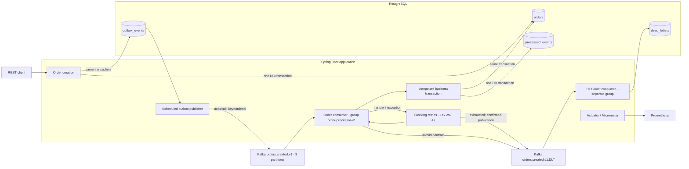

# Kafka Order Reliability Lab

A compact Java 21 / Spring Boot engineering portfolio project about **distributed messaging reliability**. An order API feeds a PostgreSQL transactional outbox, Kafka, and an idempotent order processor. Business processing records a fulfillment decision by moving an order from `PENDING` to `PROCESSED`; there are no external payments or shipping calls.

## Run locally

Requirements: Docker Engine with Compose v2 or newer, about 4 GB of available memory, and ports 8088, 9090, and 9092 available. The initial build needs internet access. PostgreSQL is accessible inside the Compose network; it does not occupy a host database port.

```sh
docker compose up --build
```

Compose builds the Java application and starts PostgreSQL, a Kafka KRaft broker, the application, and Prometheus. Startup waits for dependency health. The API uses host port 8088 to coexist with other local applications; set `APP_PORT` to override it. No host Java or Maven installation is needed for this command.

- API: http://localhost:8088/orders
- Readiness: http://localhost:8088/actuator/health/readiness
- Liveness: http://localhost:8088/actuator/health/liveness
- Metrics: http://localhost:8088/actuator/prometheus
- Prometheus: http://localhost:9090

In another terminal, run every demonstration, with assertions and printed database evidence:

```sh
docker compose --profile demo run --rm demo
```

The demo runner uses a disposable Python container and the standard library. It exits nonzero if a guarantee is violated. Run scenarios separately with:

```sh
docker compose --profile demo run --rm demo python /scripts/demo.py normal
docker compose --profile demo run --rm demo python /scripts/demo.py retry
docker compose --profile demo run --rm demo python /scripts/demo.py duplicate
docker compose --profile demo run --rm demo python /scripts/demo.py dlq
```

Alternatively, run `python3 scripts/demo.py all` on the host. Each run creates fresh event and order IDs. Keep other demo runs stopped while running assertions against the aggregate duplicate counter.

`docker compose down` stops the environment and preserves data. `docker compose down -v` also **deletes the lab's database, Kafka records, and Prometheus history**.

## Architecture



One deployment keeps the project small; producer and consumer boundaries remain visible in code. Kafka assigns the three source partitions to three consumer threads in the same group. Additional instances with the **same** group share work; a different group receives its own copy. At most three consumers in this group can process source partitions concurrently. The DLT audit uses `dead-letter-audit-v1` so it has independent offsets.

### Package map

```text
dev.resiliency.orders
├── order          REST endpoint, JPA order, creation transaction, business transaction
├── messaging      Event contract, outbox relay, Kafka configuration, source/DLT consumers
├── observability  Correlation filter, Kafka readiness check
└── demo           Opt-in failure injection, inspection, replay
```

JPA handles order creation and reads. Small, explicit JDBC statements handle PostgreSQL locking, atomic deduplication, and delivery state; both participate in Spring's database transactions. Flyway owns the schema; Hibernate only validates it.

## Event contract

Topic: `orders.created.v1`  
Kafka key: the `orderId` UUID as a string  
Value: UTF-8 JSON  
Header: `X-Correlation-ID`, matching the envelope  
Contract: [OrderCreated.java](src/main/java/dev/resiliency/orders/messaging/OrderCreated.java)  
Example: [order-created-v1.example.json](contracts/order-created-v1.example.json)

```json
{
  "eventId": "40af0c94-61ce-47f1-b2f9-ad279835cba5",
  "eventType": "OrderCreated",
  "schemaVersion": 1,
  "occurredAt": "2026-09-14T12:00:00Z",
  "correlationId": "portfolio-demo-1",
  "orderId": "ddf4d373-5f60-4ffa-a7dc-c053ec38249f",
  "payload": {
    "customerReference": "customer-42",
    "amount": 49.90,
    "currency": "USD"
  }
}
```

The producer generates the event ID once and stores the serialized envelope in the outbox. Publication retries and operator replay retain that ID and payload. An amount is a positive decimal with at most ten integer and two fraction digits. Currency is a three-letter uppercase code; this lab checks its shape, not membership in a currency catalogue. Customer references are nonblank and limited to 100 characters.

The consumer rejects malformed JSON, missing required fields, unsupported event types/versions, and a Kafka key that differs from the order ID. Invalid contracts go directly to the DLT because waiting cannot fix their content. Unknown JSON fields are tolerated for additive evolution; incompatible changes need a new contract version/topic.

Correlation IDs accept 1–100 letters, digits, dots, underscores, or hyphens. Missing/invalid HTTP IDs are replaced with UUIDs. The ID is returned in the HTTP response and propagated through the outbox, Kafka header, event, processing logs, and DLT audit. Event and order IDs enrich processing logs without becoming high-cardinality metric labels.

## Database model

| Table | Purpose and invariant |
| --- | --- |
| `orders` | Order data, `PENDING/PROCESSED` status, processing count and timestamps. The count makes duplicate effects visible. |
| `outbox_events` | Immutable event payload, order reference, publication timestamp, attempts, next retry time. Partial index covers pending records. |
| `processed_events` | Primary key `(consumer_group, event_id)`; marker and business effect commit together. |
| `dead_letters` | Raw payload, Kafka DLT position, key, correlation and exception message. Unique topic/partition/offset makes audit redelivery harmless. |
| `demo_failures` | Test control: failures remaining (`-1` means always fail) and observed processing attempts. |

See [the Flyway migration](src/main/resources/db/migration/V1__orders_and_delivery_state.sql).

## Why these patterns exist

| Pattern | Failure it addresses | Implementation |
| --- | --- | --- |
| Transactional outbox | DB commit succeeds but publishing crashes, or Kafka is unavailable | Order and event insert share a DB transaction. A poller publishes committed events later. |
| Confirmed publication | A local send call returns before Kafka has stored the record | Wait for broker acknowledgement before marking the outbox row published; DLT recovery also waits for acknowledgement. |
| Idempotent consumer | Crash after DB commit but before Kafka offset commit | Unique consumer/event marker and order effect share one DB transaction. |
| Consumer group | Multiple workers must share partitions and resume committed progress | Stable group ID, three partitions, record acknowledgement, auto-commit disabled. |
| Exponential retry | Temporary processing failures should recover without a tight retry loop | Three blocking retries after 1, 2, and 4 seconds. |
| Dead-letter topic | A persistently failing record must not block processing indefinitely | Original record and Spring Kafka diagnostic headers are published to the same partition number in the DLT. |
| Correlation and metrics | Asynchronous work is hard to follow | Structured ECS JSON logs, correlation IDs, Kafka client/listener metrics, and delivery counters. |

## Processing paths and demonstrations

### Happy path

```sh
curl -i http://localhost:8088/orders \
  -H 'Content-Type: application/json' \
  -H 'X-Correlation-ID: portfolio-demo-1' \
  -d '{"customerReference":"customer-42","amount":49.90,"currency":"USD"}'
```

The `201 Created` response contains `orderId`, `eventId`, and `correlationId`. Its `Location` points to `GET /orders/{orderId}`. Creation means the order and event are durable in PostgreSQL; processing may still be pending.

The publisher locks one eligible row with `FOR UPDATE SKIP LOCKED`, sends it, waits for acknowledgement, then sets `published_at`. The consumer inserts the deduplication marker, changes the order to `PROCESSED`, and commits. Only then can the listener commit the Kafka offset.

### Consumer failure → retry → recovery

The `retry` demo creates a failure plan for two failures. The first business transaction rolls back, leaving both processing count and deduplication count at zero. Attempts two and three occur after approximately one and two seconds. Attempt three commits exactly one effect.

The simulator updates its counter in a separate `REQUIRES_NEW` transaction, so a business rollback cannot erase the failure history. It is a deterministic stand-in for an unavailable downstream dependency, not part of the public event schema.

### Duplicate delivery

The `duplicate` demo reopens a published outbox row, reproducing the important consequence of a publisher crash after broker acknowledgement but before the DB publication marker commits. The same event ID arrives again. `INSERT ... ON CONFLICT DO NOTHING` detects the duplicate and the business update is skipped.

Concurrent deliveries of the same ID are also safe: PostgreSQL serializes the unique-key conflict. If the first transaction rolls back, another attempt can insert the marker and perform the effect.

### Exhausted retries → DLT → repair and replay

The `dlq` demo always fails. Four total attempts occur, with delays of 1, 2, and 4 seconds. After exhaustion, the recoverer publishes to `orders.created.v1.DLT`; the source offset becomes eligible for commit only after publication succeeds.

The audit listener persists the raw record and diagnostics. The order remains `PENDING`, with no deduplication marker. A dead letter represents unresolved work, not successful business processing.

The demo then clears the failure plan and replays the retained outbox event. Processing succeeds once, and the DLT audit remains as history. Replay is an explicit operator action; there is no automatic DLT-to-source loop. If DLT publication fails, recovery throws and the source record is redelivered. If the audit database is unavailable, the DLT listener retries indefinitely.

Inspect evidence:

```sh
curl http://localhost:8088/demo/dead-letters
docker compose exec kafka /opt/kafka/bin/kafka-console-consumer.sh \
  --bootstrap-server kafka:19092 --topic orders.created.v1.DLT \
  --from-beginning --timeout-ms 10000 --property print.headers=true
docker compose exec kafka /opt/kafka/bin/kafka-consumer-groups.sh \
  --bootstrap-server kafka:19092 --describe --group order-processor-v1
docker compose logs -f app
```

### Broker and process outages

```sh
docker compose stop kafka
# POST /orders still commits to PostgreSQL. The outbox remains pending.
curl -s http://localhost:8088/orders -H 'Content-Type: application/json' \
  -d '{"customerReference":"broker-outage","amount":10.00,"currency":"USD"}'
docker compose start kafka
# The retained event is published after the next scheduled outbox retry.
```

Outbox retry delays increase from 1 to 60 seconds and continue without a fixed attempt limit. Send timeouts are bounded. A restart can redeliver records, so both business processing and DLT audit tolerate duplicates. Compose persists Kafka and PostgreSQL data in named volumes.

Graceful shutdown stops HTTP intake and lets Spring stop listeners and scheduled work. A hard kill can interrupt any transaction; unfinished DB work rolls back, and uncommitted Kafka offsets allow redelivery.

## Delivery guarantees and limits

- **At-least-once delivery; idempotent local database effects.** There is no atomic transaction spanning Kafka and PostgreSQL and no claim of end-to-end exactly-once delivery.
- Kafka producer idempotence protects producer-level retries. It cannot deduplicate a later outbox publication or a new producer session; the consumer's event ID guard does that.
- A crash between Kafka acknowledgement and outbox commit can duplicate a message. A crash between business commit and offset commit can redeliver it. Both are expected.
- A crash after DLT publication but before source offset commit can duplicate a dead letter. Audit uniqueness covers the same DLT offset; distinct DLT records remain separate evidence.
- Deduplication covers event IDs within this consumer group. It does not deduplicate repeated HTTP requests: two creates generate two orders. A client idempotency key would be a separate feature.
- The order status guard also prevents a second business effect if another event ID refers to an already processed order; that invalid transition is dead-lettered.
- Retry counters for business delivery live in the listener's memory. A crash/rebalance can restart the retry budget. Four attempts is the uninterrupted-process budget, not a durable global maximum.
- The Kafka key preserves broker order within a partition. Multiple outbox publishers can reorder events before publication; this lab has only one creation event per order. Strict multi-event aggregate ordering requires explicit sequencing.
- External side effects are outside the database transaction. A real payment/shipping integration needs downstream idempotency keys, another outbox, or a workflow with compensation.
- Durability depends on retained database/Kafka data. The single local broker, replication factor one, plaintext networking, and development credentials demonstrate mechanics, not production high availability.

## Observability

Prometheus scrapes every five seconds. Useful queries:

```promql
sum(rate(lab_consumer_processed_total[5m]))
sum(rate(lab_consumer_failures_total[5m]))
sum(rate(lab_consumer_retries_total[5m]))
sum(rate(lab_consumer_duplicates_total[5m]))
sum(rate(lab_consumer_dead_lettered_total[5m]))
lab_outbox_pending
sum(rate(lab_outbox_publish_failures_total[5m]))
kafka_consumer_fetch_manager_records_lag_max
spring_kafka_listener_seconds_count
```

Kafka consumer/producer metrics are bound by Spring Boot's Kafka auto-configuration. Custom counters appear after their first event; IDs are kept in logs rather than metric labels. `lab.consumer.retries` counts failed redeliveries, while listener timers count successful and failed invocations. Counters are operational signals and reset on restart; the database is the durable evidence.

Readiness includes PostgreSQL and Kafka. Liveness only describes the application lifecycle, so a broker outage does not demand restarting the application. With an external router, Kafka readiness failure would remove this combined API/worker deployment from traffic even though order intake could still persist to the outbox; splitting roles allows separate readiness policies.

## Tests

Install JDK 21 and provide a working Docker daemon:

```sh
./mvnw clean verify
```

The checked-in Maven wrapper pins Maven 3.9.11. Surefire runs JUnit 5 unit tests; Failsafe runs `ReliabilityIT` against real PostgreSQL 17 and Kafka 3.9 Testcontainers. Docker must be available: integration tests are not silently skipped. Container ports are random, so tests can run alongside Compose. The test Docker client pins API 1.44 for compatibility with Docker Engine 29.

The suite checks atomic order/outbox rollback, happy-path contracts and correlation, rollback before retry, eventual recovery, Kafka duplicates, concurrent deduplication, exhausted retries and DLT diagnostics, repair/replay, malformed JSON, failed DLT acknowledgement, validation, health/metrics, consumer catch-up, and a paused Kafka broker with eventual outbox recovery. Tests use bounded condition polling.

The Docker image build packages the application without running integration tests inside the build container. Run `./mvnw clean verify` separately as the verification gate.

## Trade-offs and evolution

- **Polling vs CDC:** The small SQL relay is easy to inspect. It holds a row lock/DB connection while waiting for Kafka and publishes sequentially. At scale, consider change-data capture, leased batches, or bounded parallel publishers with per-aggregate ordering.
- **Blocking retries:** Simple and preserves the failing record's place in its partition. It blocks that consumer thread, potentially all partitions assigned to it. Longer backoffs need pause-aware handling or retry topics, with an explicit ordering trade-off and a poll-interval budget.
- **Retention:** Outbox, deduplication, and audit records are retained indefinitely for demonstration. Add archival, partitioning, pending-age alerts, and retention policies. Deduplication retention must cover the entire possible replay horizon.
- **Deployment boundaries:** Split API/relay/processor roles when their scaling or availability needs differ; use the same consumer group for replicated processors. More active workers require more partitions.
- **Operational recovery:** Add audited replay authorization, quarantine inspection, rate-limited replay, and alerts on DLT growth and oldest pending outbox age. Disable `LAB_DEMO_ENABLED` outside the local lab; failure/replay endpoints are unauthenticated and intentionally bound to localhost through Compose.
- **Production infrastructure:** Use multiple Kafka brokers, appropriate replication/minimum in-sync replicas, database backups, authenticated encrypted connections, and managed secrets. Validate upgrades and pin image digests in a deployment pipeline.
- **Contract evolution:** Add a schema registry and compatibility checks when more producers/consumers share contracts. Add tracing across service boundaries when correlation alone no longer suffices.

Implementation follows the [Spring Kafka error-handling model](https://docs.spring.io/spring-kafka/reference/kafka/annotation-error-handling.html), [Spring Boot structured logging](https://docs.spring.io/spring-boot/3.5/reference/features/logging.html#features.logging.structured), and [PostgreSQL row-locking semantics](https://www.postgresql.org/docs/17/sql-select.html).
